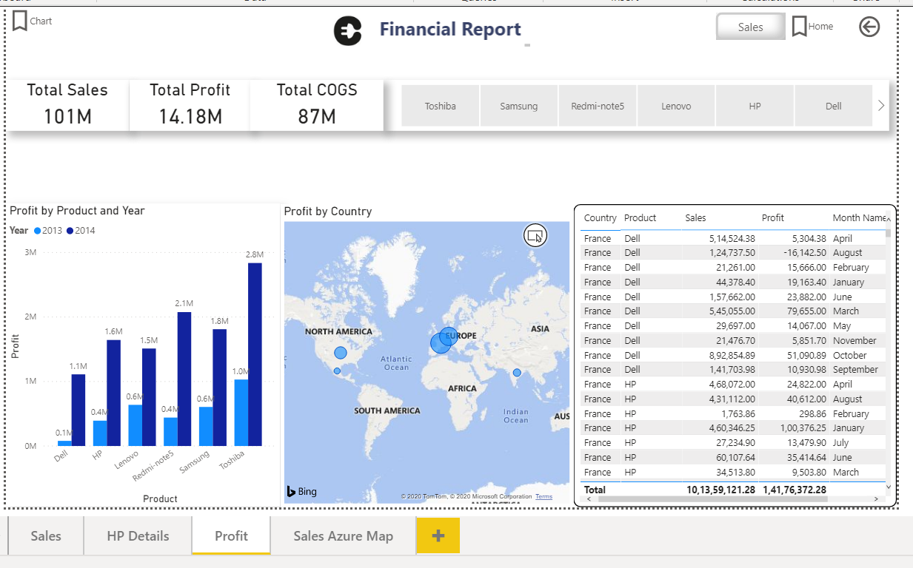
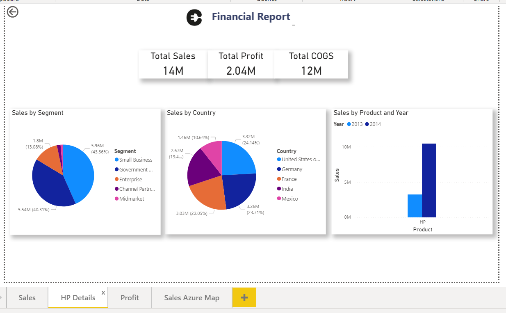
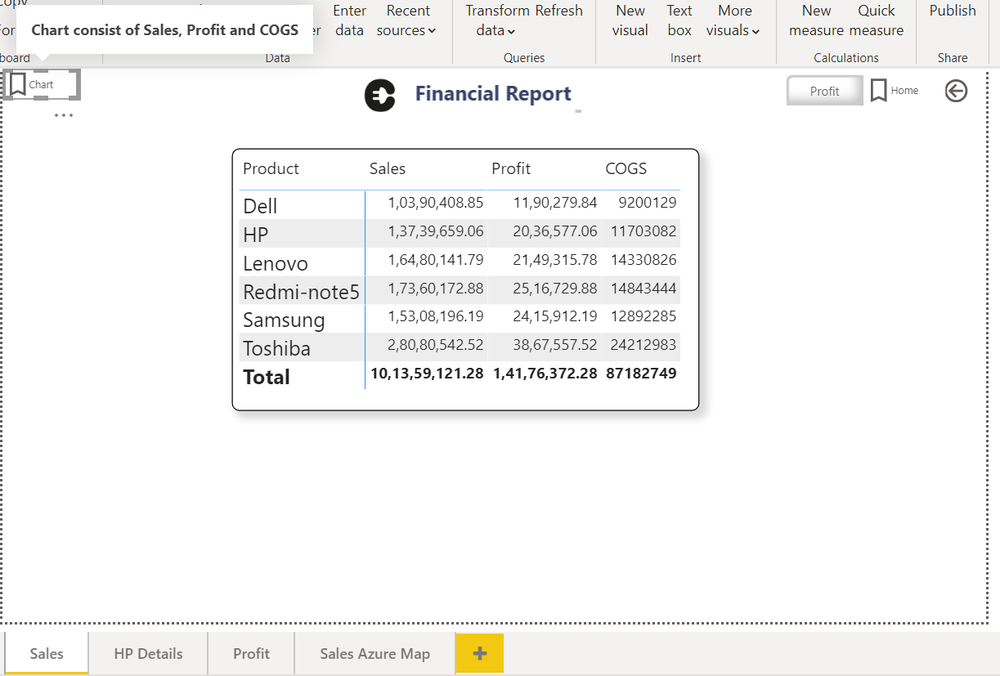

# Financial-Report---Celebal
In this project we have created a multi-page Dashboard which is used to visualize overall Total Sales, Total Profit. Some important feature like implement Row Level Security, Dynamic axis via Slicer, Bookmark and drill-through filter.

This is the First Page in Report where we see details based on Sales.

This is the next Page in Report where we see details based on Profit.

This is the next Page in Report where we see details based on filter by HP product.

Implemented Bookmark in first page of Dashboard, where we can see chart consist of sales, profit and COGS based on product.

